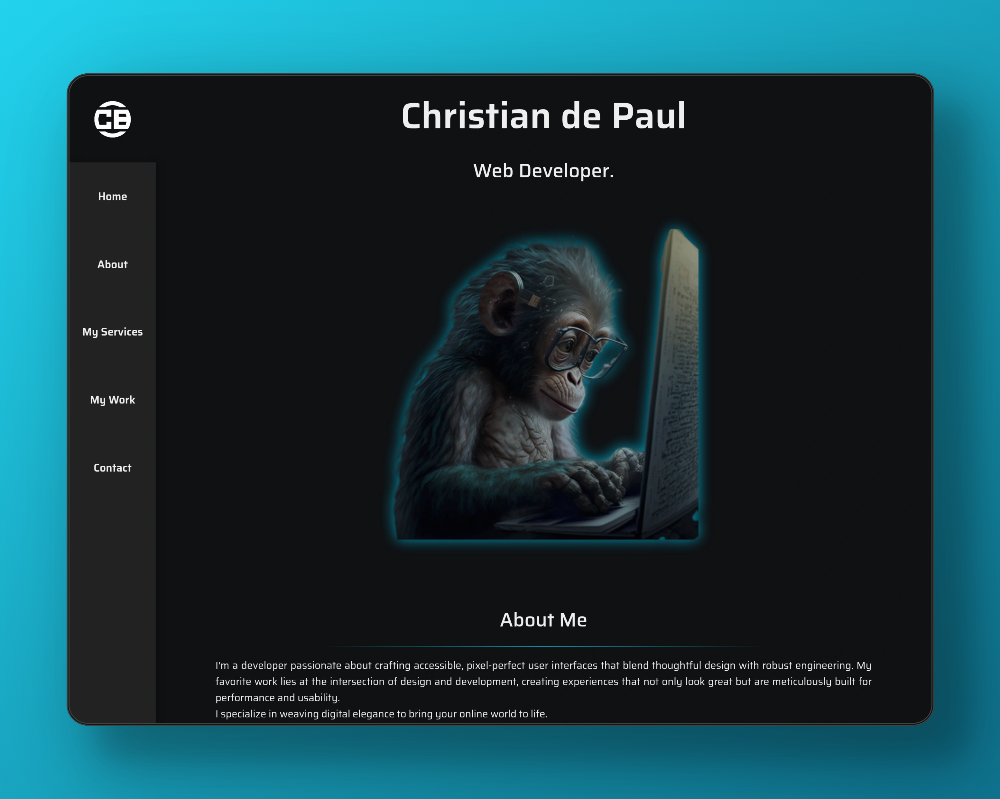
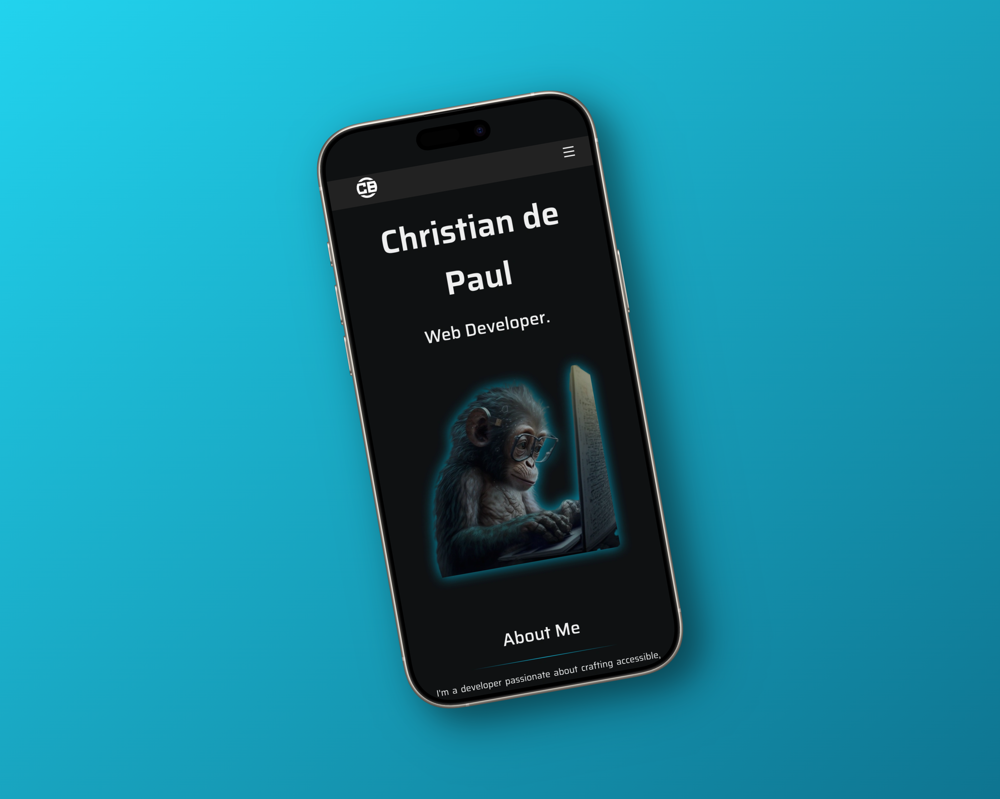

# Portafolio Personal

Este es mi portafolio como desarrollador web, creado con HTML, CSS y JavaScript. Aquí muestro algunos de mis proyectos, habilidades y formas de contacto.

## 🔧 Tecnologías

- HTML5
- CSS3
- JavaScript (Vanilla)

## 📁 Estructura

- `/index.html`: Página principal del portafolio.
- `/css/`: Estilos personalizados.
- `/js/`: Scripts para interacción y funcionalidad.

## 🚀 Cómo ver el sitio

[ChristiandePaul](https://christian-de-paul-portfolio.windsurf.build)

## ✨ Características

- Diseño responsivo
- Sección de proyectos con capturas
- Contacto directo (puede enlazar a WhatsApp, email, etc.)

## 📬 Contacto

Podés contactarme a través de [tuemail@example.com] o [LinkedIn/TuRed].

---

Gracias por visitar mi portafolio 👋
